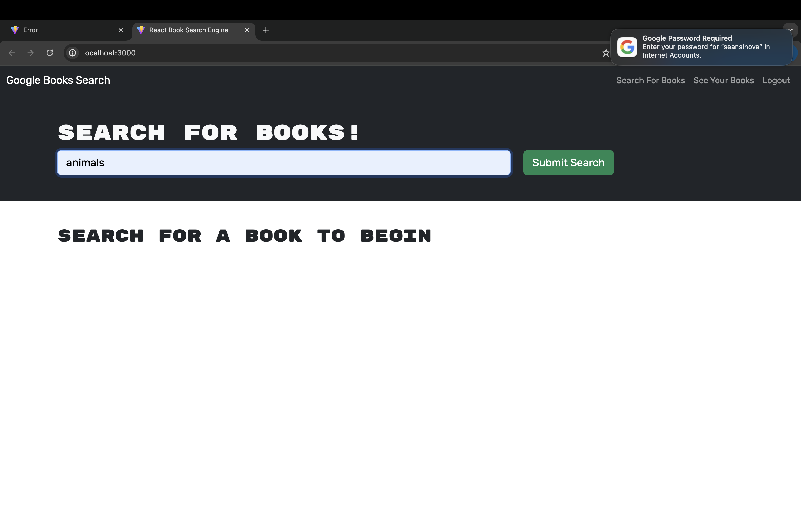

# Book-Search-Engine

The Book Search Engine is a MERN (MongoDB, Express.js, React, Node.js) stack application that allows users to search for books using the Google Books API and find out more about their favorite books!

## Technologies Used
	React
	Apollo Client
	GraphQL
    Node.js
	Express.js
	MongoDB
	Apollo Server

